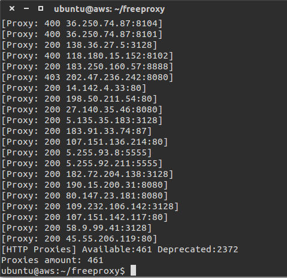

## freeproxy

Get http proxies from some free proxy sites.

| Site | Accessibility |
|--------|--------|
| [pachong.org](http://pachong.org/) |China Only |
| [cn-proxy.com](http://cn-proxy.com/)| Exclude China |
| [txt.proxyspy.net](http://txt.proxyspy.net/proxy.txt)| Exclude China |
| [free-proxy-list](http://free-proxy-list.net/)| Exclude China |
| [www.gatherproxy.com](http://www.gatherproxy.com)| Exclude China |
| [www.hide-my-ip.com](https://www.hide-my-ip.com/proxylist.shtml)| Exclude China |
| [www.getproxy.jp](http://www.getproxy.jp/)| Exclude China<br>Account Required |
| [www.xicidaili.com](http://www.xicidaili.com/)| World Wide |
| [www.cybersyndrome.net](http://www.cybersyndrome.net/)| World Wide |

### Installing

```python
$ pip install freeproxy
```
Requirements

- [requests](http://docs.python-requests.org/)
- [peewee](http://docs.peewee-orm.com/en/latest/index.html)
- [gevent](http://www.gevent.org/index.html)
- [beautifulsoup4](https://www.crummy.com/software/BeautifulSoup/bs4/doc/)

## Usage

### Collect proxies

Fetch latest proxies from above sites and test them using `URL`.

```python
$ freeproxy "https://www.google.com"
```

Testing results are stored in `~/.freeproxy/proxy.db` ([sqlite](https://www.sqlite.org/)). Below is the [peewee](http://docs.peewee-orm.com/en/latest/peewee/models.html) model:

```python
class Proxy(Model):
    """
    Database Model
    """
    proxy = CharField(primary_key=True)  # "ip:port"
    check_time = DateTimeField(null=True)  # time of testing
    response_time = FloatField(null=True)  # response time(seconds)
    status_code = IntegerField(null=True)  # status code
```

If the testing `URL` was unreachable:

- `status_code` would be `None`
- `response_time` would be `None`

### Test proxies

You can use the default testing method(Test all the proxies stored in database) or define your own strategy.

`freeproxy -t URL` uses the default one.

### Read proxies

The default method `freeproxy.read_proxies()` reads all the proxies from database whose `status_code` is `200`.

You can implement your own one.

### Customize

See [peewee doc](http://docs.peewee-orm.com/en/latest/peewee/querying.html) for querying, or write your own SQL.

```Python
from freeproxy import from_pachong_org, from_xici_daili, from_cyber_syndrome
from freeproxy import Proxy, test_proxies, init_db


def your_fetching():
    proxies = from_pachong_org() + from_xici_daili() + from_cyber_syndrome()
    test_proxies(proxies, timeout=8, single_url='http://www.baidu.com')


def your_reading():
    query = Proxy.select().where(~(Proxy.status_code >> None))
    return [p.proxy for p in query]


def your_testing():
    test_proxies(your_reading(), single_url="http://www.baidu.com")


if __name__ == '__main__':
    init_db()  # If you have never successfully run `freeproxy` on Terminal
    your_fetching()
    your_testing()

```

## ScreenShot


